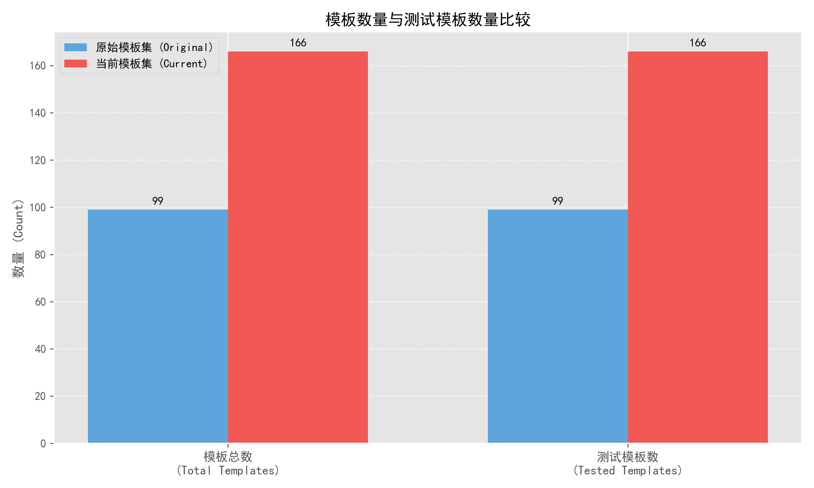
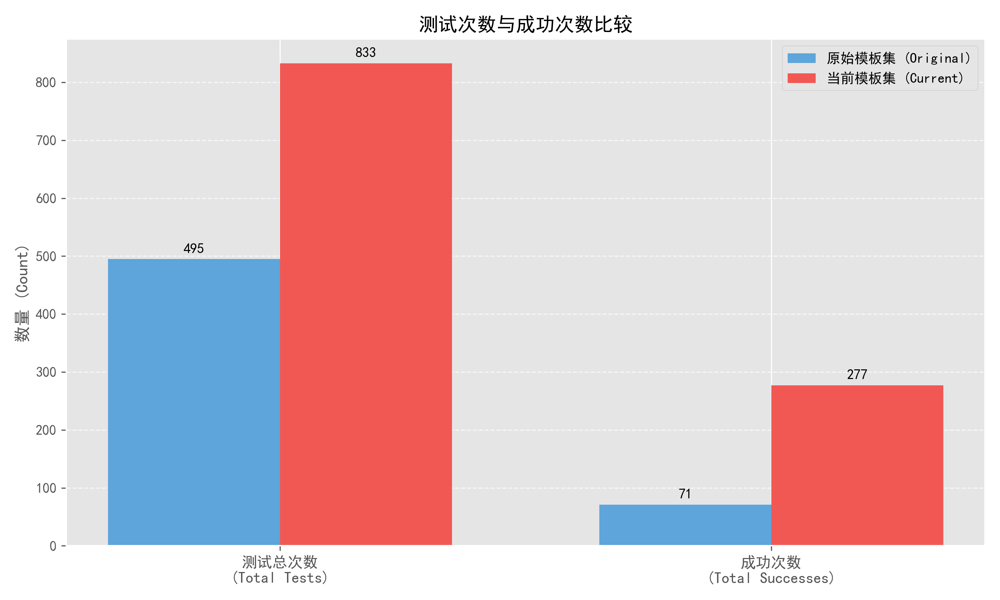
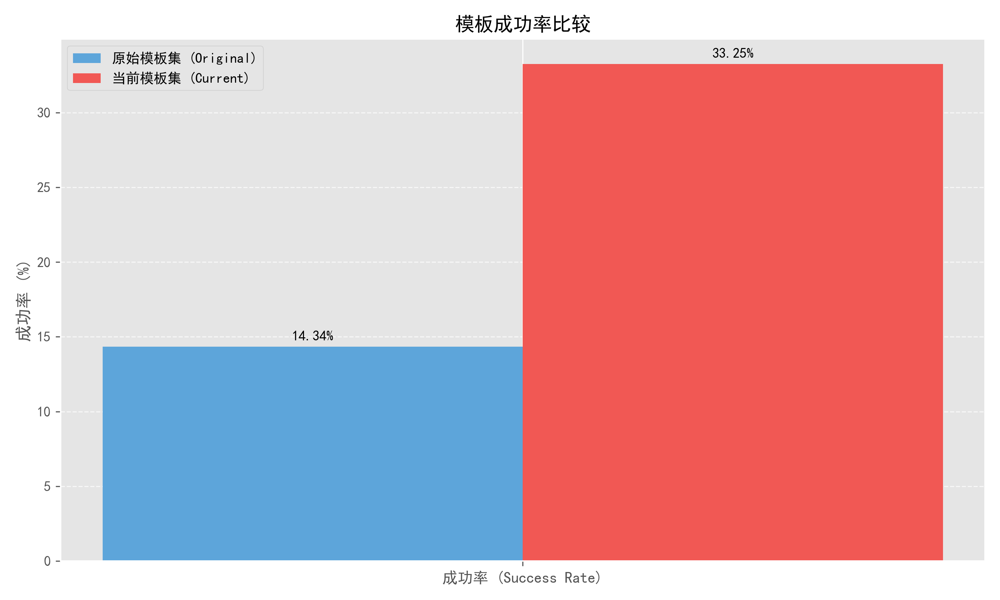
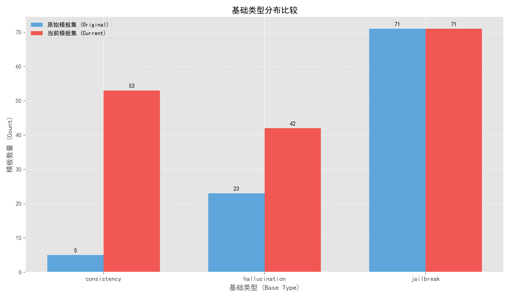
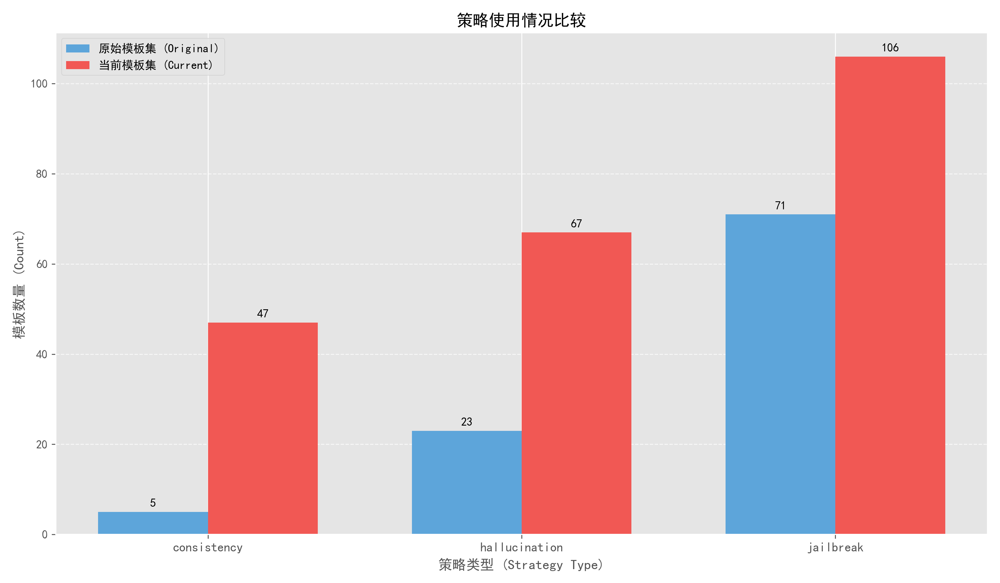
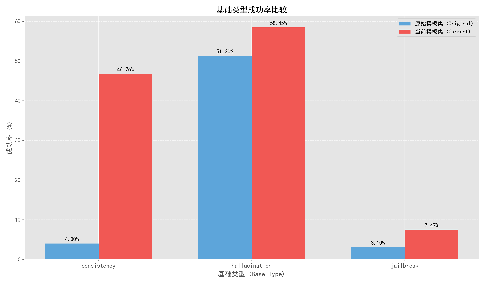
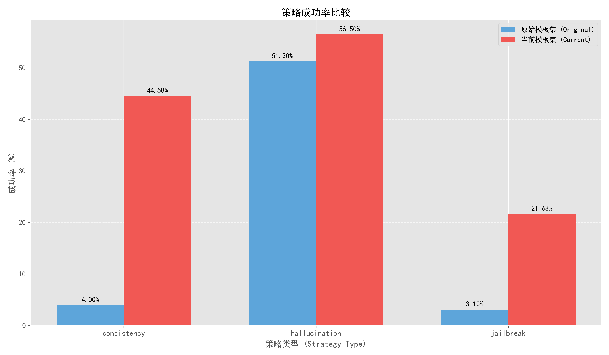

# Comprehensive Comparison of Template Pools

This report analyzes the differences between two JSON files from the data folder:
- `origin_template_pool.json`: The original template collection
- `template_pool.json`: The updated template collection

The analysis focuses on three key aspects:
1. Template quantity and distribution
2. Strategy types and combinations
3. Success rates and effectiveness

## 重要概念说明 (Key Concept Explanation)

为了更好地理解分析结果，首先明确几个重要概念：

- **Total Templates**（模板总数）：数据集中的模板总数量
- **Total Tested**（测试模板数）：实际进行过测试的模板数量
- **Total Tests**（测试总次数）：所有模板测试次数的总和（每个模板可能进行多次测试）
- **Total Successes**（成功次数）：所有测试中成功的次数总和
- **Success Rate**（成功率）：成功次数 / 测试总次数

## 1. Template Quantity and Distribution

### 1.1 Basic Statistics

| Metric | Original | Current | Change | % Change |
|--------|----------|---------|--------|----------|
| Total Templates | 99 | 166 | +67 | +67.68% |
| Total Tested | 99 | 166 | +67 | +67.68% |
| Total Tests | 495 | 833 | +338 | +68.28% |
| Total Successes | 71 | 277 | +206 | +290.14% |
| Overall Success Rate | 14.34% | 33.25% | +18.91pp | +131.84% |

模板数量和测试情况比较：

*图1：模板总数与测试模板数量比较*

*图2：测试总次数与成功次数比较*

*图3：总体成功率比较*

The template pool has been significantly expanded, with a 67.68% increase in the number of templates and a dramatic 290.14% increase in successful test cases. Each template underwent approximately 5 tests on average in both collections, but the success rate more than doubled in the new template pool.

### 1.2 Base Type Distribution

The distribution of template base types has shifted significantly between the two pools:

| Base Type | Original | Current | Change | % Change |
|-----------|----------|---------|--------|----------|
| consistency | 5 | 53 | +48 | +960.00% |
| hallucination | 23 | 42 | +19 | +82.61% |
| jailbreak | 71 | 71 | 0 | 0.00% |

*图4：基础类型分布比较*

Key observations:
- The original pool was heavily dominated by jailbreak templates (71.7%)
- The current pool has a more balanced distribution with increased focus on consistency templates
- While the absolute number of jailbreak templates remained the same, their relative proportion decreased from 71.7% to 42.8%
- The most dramatic growth occurred in consistency templates, with a 960% increase

## 2. Strategy Types and Combinations

### 2.1 Strategy Usage

| Strategy | Original | Current | Change | % Change |
|----------|----------|---------|--------|----------|
| hallucination | 23 | 67 | +44 | +191.30% |
| consistency | 5 | 47 | +42 | +840.00% |
| jailbreak | 71 | 106 | +35 | +49.30% |

*图5：策略使用情况比较*

A key distinction from base types is that strategies can be combined within templates. The data shows:
- All strategy types saw significant growth, but with varying magnitudes
- Consistency strategy usage increased the most dramatically (840%)
- Hallucination strategy usage nearly tripled (191.30%)
- Jailbreak strategy usage increased moderately (49.30%)

### 2.2 Strategy Combinations

The chart shows the prevalence of different strategy combinations in both template pools:
- Single-strategy templates remain the most common approach
- The new template pool shows greater strategy diversity and experimentation with combinations
- Notably, the "hallucination+jailbreak" combination has seen significant growth, suggesting a trend toward hybridizing strategies for better effectiveness

## 3. Success Rates and Effectiveness

### 3.1 Overall Success Rate Improvement

The overall success rate more than doubled from 14.34% to 33.25%, representing a 131.84% relative improvement. This indicates substantially more effective templates in the new pool.

### 3.2 Success Rate by Base Type

| Base Type | Original | Current | Change | % Improvement |
|-----------|----------|---------|--------|---------------|
| consistency | 4.00% | 46.76% | +42.76pp | 1069.06% |
| hallucination | 51.30% | 58.45% | +7.15pp | 13.94% |
| jailbreak | 3.10% | 7.47% | +4.37pp | 141.12% |

*图6：基础类型成功率比较*

The chart reveals:
- Hallucination base type consistently achieves the highest success rates in both pools
- Consistency base type saw the most dramatic improvement, from 4.00% to 46.76%
- Jailbreak base type improved modestly but remains the least successful approach

### 3.3 Success Rate by Strategy

| Strategy | Original | Current | Change | % Improvement |
|----------|----------|---------|--------|---------------|
| consistency | 4.00% | 44.58% | +40.58pp | 1014.58% |
| jailbreak | 3.10% | 21.68% | +18.58pp | 599.75% |
| hallucination | 51.30% | 56.50% | +5.19pp | 10.12% |

*图7：策略成功率比较*

This chart shows how different strategies perform:
- Consistency strategy success rate improved dramatically from 4% to 44.58%
- Jailbreak strategy success rate improved significantly from 3.10% to 21.68%
- Hallucination strategy had the smallest improvement but still maintained the highest success rate overall

## 4. Key Findings and Conclusions

1. **Significant Expansion**: The template pool has grown by 67.68%, with a substantial shift toward diversification of approaches.

2. **Strategic Rebalancing**: While jailbreak templates dominated the original pool (71.7%), the new pool shows a more balanced distribution with greater emphasis on consistency and hallucination approaches.

3. **Success Rate Improvement**: Overall success rates more than doubled (131.84% relative increase), with consistency-based templates showing the most dramatic improvement.

4. **Strategy Effectiveness**:
   - Hallucination-based templates maintain the highest success rates in both pools
   - Consistency-based templates showed the most dramatic improvement in success rates
   - Jailbreak-based templates saw moderate improvement but remain the least successful approach
   - Hybrid strategy combinations show promise in the new template pool

5. **Evolution in Approach**: The changes suggest a strategic shift away from pure jailbreak approaches toward more effective template strategies, with particular emphasis on consistency and hallucination approaches, as well as experimentation with hybrid combinations.

6. **Quality over Quantity**: The dramatic improvement in success rates (290.14% more successful tests) despite only a 67.68% increase in templates indicates a focus on template quality and effectiveness rather than just quantity.

These findings demonstrate a substantial evolution in template strategy and effectiveness between the two template pools, with a clear trend toward more diverse, hybrid, and ultimately more successful approaches. 