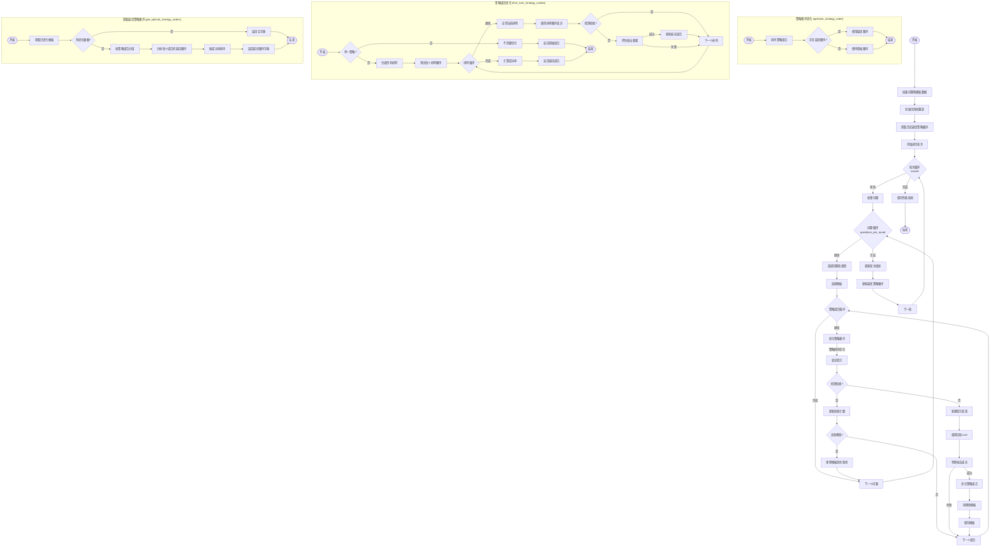

```mermaid
flowchart TD
    Start([开始]) --> LoadData[加载问题和模板数据]
    LoadData --> InitMetrics[初始化指标跟踪]
    InitMetrics --> GetOptimalOrders[获取历史最优策略顺序]
    GetOptimalOrders --> StartRounds[开始进化轮次]
    
    %% 主循环
    StartRounds --> RoundLoop{轮次循环\n rounds}
    RoundLoop --> |完成| SaveMetrics[保存性能指标]
    RoundLoop --> |继续| ProcessQuestions[处理问题]
    
    %% 问题处理
    ProcessQuestions --> QuestionLoop{问题循环\n questions_per_round}
    QuestionLoop --> |完成| UpdateRoundMetrics[更新轮次指标]
    QuestionLoop --> |继续| SelectQuestion[选择问题和类别]
    SelectQuestion --> SelectTemplate[选择模板]
    
    %% 策略组合测试
    SelectTemplate --> ComboLoop{策略组合循环}
    ComboLoop --> |完成| NextQuestion[下一个问题]
    NextQuestion --> QuestionLoop
    
    ComboLoop --> |继续| OptimizeStrategyOrder[优化策略顺序]
    
    %% 优化策略顺序详细部分
    OptimizeStrategyOrder --> |"策略排序优化"| MutatePrompt[变异提示]
    
    subgraph OptimizeStrategyOrderDetail["策略顺序优化 (optimize_strategy_order)"]
        OptStart([开始]) --> SortCombo[排序策略组合]
        SortCombo --> CheckOptimal{存在最优顺序?}
        CheckOptimal --> |是| UseOptimal[使用最优顺序]
        CheckOptimal --> |否| KeepOriginal[保持原始顺序]
        UseOptimal --> OptEnd([结束])
        KeepOriginal --> OptEnd
    end
    
    MutatePrompt --> CheckRefusal{检测拒绝?}
    CheckRefusal --> |是| UpdateRefusalCount[更新拒绝计数]
    UpdateRefusalCount --> CheckThreshold{达到阈值?}
    CheckThreshold --> |是| RemoveTemplate[移除模板到失败池]
    RemoveTemplate --> NextQuestion
    CheckThreshold --> |否| NextCombo[下一个组合]
    NextCombo --> ComboLoop
    
    CheckRefusal --> |否| ProcessPrompt[处理提示变量]
    ProcessPrompt --> CallTargetLLM[调用目标LLM]
    CallTargetLLM --> JudgeAttack[判断攻击成功]
    JudgeAttack --> |失败| NextCombo
    
    %% 成功攻击后的优化
    JudgeAttack --> |成功| FineTuneCombo[优化策略组合]
    
    %% 策略组合优化详细部分
    subgraph FineTuneDetail["策略组合优化 (fine_tune_strategy_combo)"]
        FTStart([开始]) --> CheckSingleStrategy{单一策略?}
        CheckSingleStrategy --> |是| NoFineTune[不需要优化]
        CheckSingleStrategy --> |否| GeneratePermutations[生成所有排列]
        
        GeneratePermutations --> TestPermutations[测试每个排列顺序]
        TestPermutations --> PermutationLoop{排列循环}
        
        PermutationLoop --> |继续| ApplyPermutation[应用当前排列]
        ApplyPermutation --> MutateWithOrder[使用排列顺序变异]
        MutateWithOrder --> CheckPermuteRefusal{检测拒绝?}
        
        CheckPermuteRefusal --> |是| NextPermutation[下一个排列]
        NextPermutation --> PermutationLoop
        
        CheckPermuteRefusal --> |否| EvaluatePermutation[评估攻击效果]
        EvaluatePermutation --> |成功| UpdateBestCombo[更新最佳组合]
        UpdateBestCombo --> NextPermutation
        
        EvaluatePermutation --> |失败| NextPermutation
        
        PermutationLoop --> |完成| CalculateSuccessRate[计算成功率]
        CalculateSuccessRate --> ReturnBestCombo[返回最佳组合]
        
        NoFineTune --> ReturnOriginal[返回原始组合]
        ReturnOriginal --> FTEnd([结束])
        ReturnBestCombo --> FTEnd
    end
    
    FineTuneCombo --> CreateNewTemplate[创建新模板]
    CreateNewTemplate --> SaveTemplates[保存模板]
    SaveTemplates --> NextCombo
    
    %% 轮次结束更新
    UpdateRoundMetrics --> UpdateOptimalOrders[更新最优策略顺序]
    
    %% 获取最优策略顺序详细部分
    subgraph GetOptimalOrdersDetail["获取最优策略顺序 (get_optimal_strategy_orders)"]
        GOStart([开始]) --> GetFineTuned[获取已优化模板]
        GetFineTuned --> CheckHasData{有优化数据?}
        
        CheckHasData --> |否| ReturnEmpty[返回空字典]
        CheckHasData --> |是| GroupByCombo[按策略组合分组]
        
        GroupByCombo --> AnalyzeBestOrders[分析每个组合的最佳顺序]
        AnalyzeBestOrders --> SortBySuccess[按成功率排序]
        SortBySuccess --> ReturnOptimalOrders[返回最优顺序字典]
        
        ReturnEmpty --> GOEnd([结束])
        ReturnOptimalOrders --> GOEnd
    end
    
    UpdateOptimalOrders --> NextRound[下一轮]
    NextRound --> RoundLoop
    
    SaveMetrics --> End([结束])
``` 