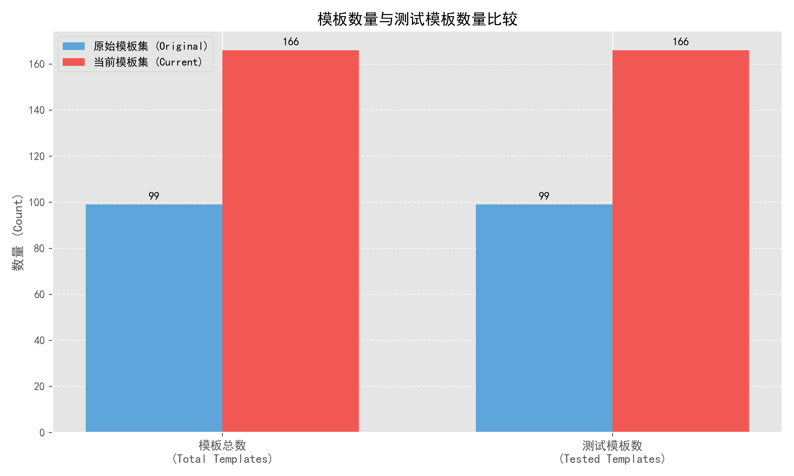
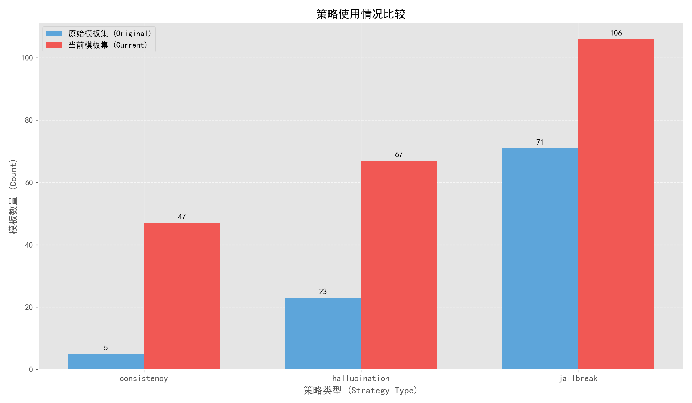
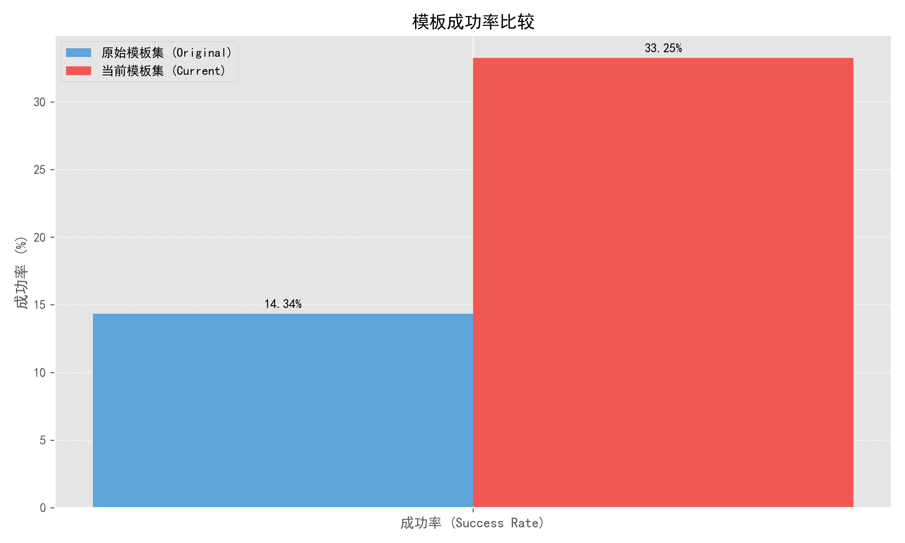
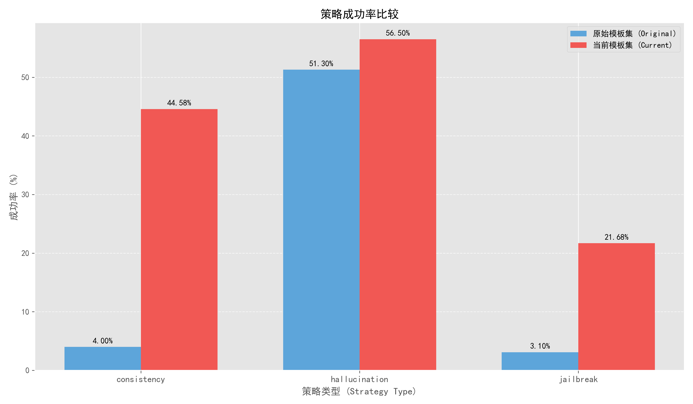

# Template Pool Comparison: origin_template_pool.json vs template_pool.json

## 1. Template Count Comparison

- **Original Templates**: 99
- **New Templates**: 166
- **Increase**: 67 templates (67.68%)

The template pool has been significantly expanded, with a 67.68% increase in the number of templates. This suggests a substantial effort to diversify the template collection.

> **重要说明**：
> - **Total Templates**（模板总数）：指数据集中的模板总数量
> - **Total Tested**（测试模板数）：实际进行过测试的模板数量
> - **Total Tests**（测试总次数）：所有模板测试次数的总和（每个模板可能进行多次测试）
> - **Total Successes**（成功次数）：所有测试中成功的次数总和

*图1：模板总数与测试模板数量比较*

*图2：测试总次数与成功次数比较*

## 2. Strategy Distribution Comparison

### Strategy Usage Changes:

| Strategy      | Original | Current | Change    | % Increase |
|---------------|----------|---------|-----------|------------|
| hallucination | 23       | 67      | +44       | 191.30%    |
| consistency   | 5        | 47      | +42       | 840.00%    |
| jailbreak     | 71       | 106     | +35       | 49.30%     |

Key observations:
- **Consistency strategy** has seen the most dramatic increase (840%), showing a clear shift in focus toward this approach
- **Hallucination strategy** templates nearly tripled (191.30% increase)
- **Jailbreak strategy** had the smallest relative growth but still increased by half (49.30%)

*图3：策略使用情况比较*

### Base Type Distribution:

| Base Type     | Original | Current | Change    | % Increase |
|---------------|----------|---------|-----------|------------|
| consistency   | 5        | 53      | +48       | 960.00%    |
| hallucination | 23       | 42      | +19       | 82.61%     |
| jailbreak     | 71       | 71      | 0         | 0.00%      |

- The number of **jailbreak base type** templates remained constant (71)
- **Consistency base type** templates increased dramatically (960%)
- **Hallucination base type** templates nearly doubled (82.61% increase)

*图4：基础类型分布比较*

## 3. Success Rate Comparison

### Overall Success Rate:
- **Original**: 14.34%
- **Current**: 33.25%
- **Improvement**: 18.91 percentage points (131.84% relative increase)

The overall success rate more than doubled, indicating significant improvement in template effectiveness.

*图5：总体成功率比较*

### Strategy Success Rates:

| Strategy      | Original | Current | Change   | % Improvement |
|---------------|----------|---------|----------|---------------|
| consistency   | 4.00%    | 44.58%  | +40.58pp | 1014.58%      |
| jailbreak     | 3.10%    | 21.68%  | +18.58pp | 599.75%       |
| hallucination | 51.30%   | 56.50%  | +5.19pp  | 10.12%        |

- **Consistency strategy** success rate improved dramatically from 4% to 44.58%
- **Jailbreak strategy** success rate improved significantly from 3.10% to 21.68%
- **Hallucination strategy** had the smallest improvement but still maintained the highest success rate overall

*图6：策略成功率比较*

### Base Type Success Rates:

| Base Type     | Original | Current | Change   | % Improvement |
|---------------|----------|---------|----------|---------------|
| consistency   | 4.00%    | 46.76%  | +42.76pp | 1069.06%      |
| hallucination | 51.30%   | 58.45%  | +7.15pp  | 13.94%        |
| jailbreak     | 3.10%    | 7.47%   | +4.37pp  | 141.12%       |

- **Consistency base type** saw the largest improvement in success rate
- **Hallucination base type** maintained the highest success rate in both pools
- **Jailbreak base type** saw moderate improvement but remains the least successful approach

*图7：基础类型成功率比较*

## Key Findings

1. The template pool has been substantially expanded with a focus on consistency and hallucination strategies.
2. There has been a shift in strategy emphasis, with greater focus on consistency approaches.
3. Overall success rates have more than doubled (131.84% increase).
4. Consistency-based templates showed the most dramatic improvement in success rates.
5. While jailbreak templates remain numerous, their success rates are still relatively low compared to other strategies.
6. Hallucination-based templates consistently achieve the highest success rates in both the original and new template pools.

These changes suggest a strategic shift toward more effective template approaches, with particular emphasis on improving consistency-based templates while maintaining the diverse range of template types. 